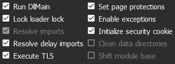
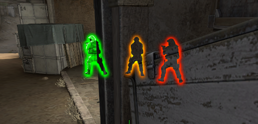

# CSGO Internal

inject with manual mapping

Like you can see the glow progress from green to red (based on health) 
The skin is green for a better rendered.

# FEATURE
- [x] BunnyHop
- [x] Radar Hack
- [x] Anti Flash
- [x] Glow ESP
- [ ] Trigger Bot
- [ ] Aim Bot
- [ ] Auto Recoil (work with aimbot)

# OFFSET
You can find all offset <a href="https://github.com/frk1/hazedumper/blob/master/csgo.hpp">here</a>
